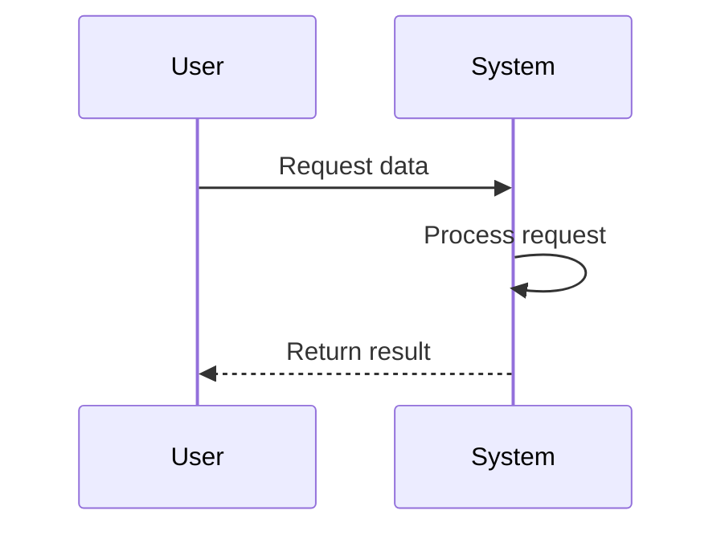
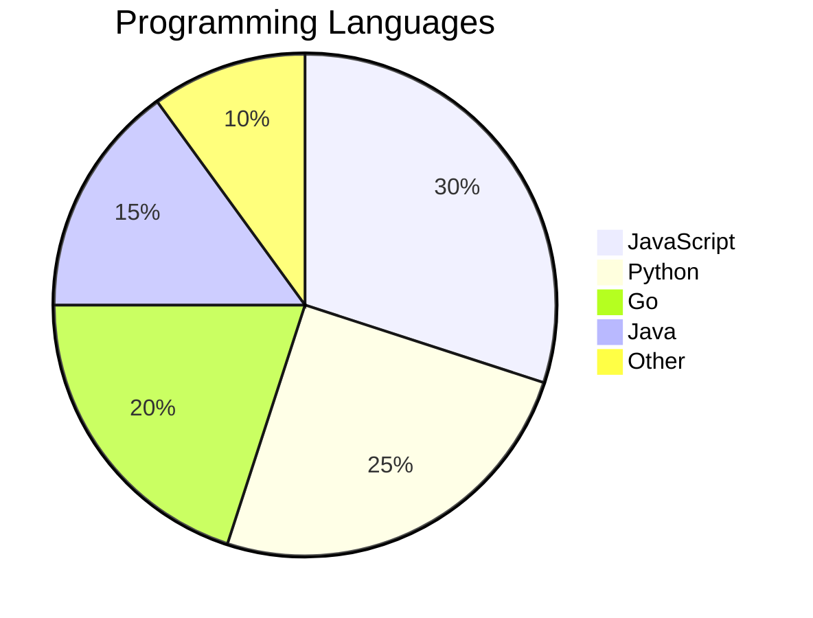
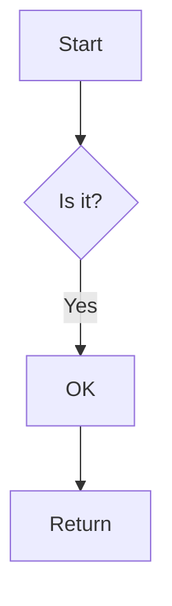

Your content here.

This is some code 

```python
print("Hello World")
```

```javascript
console.log("Hello World");
```

```go
func main() {
    fmt.Println("Hello World")
}
```

These are some mermaid diagrams -





